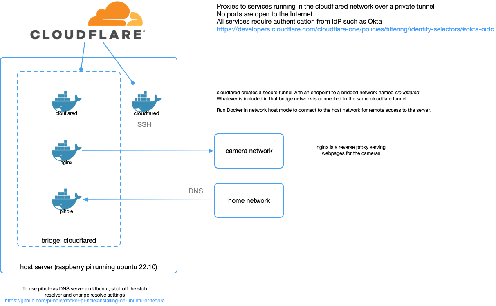
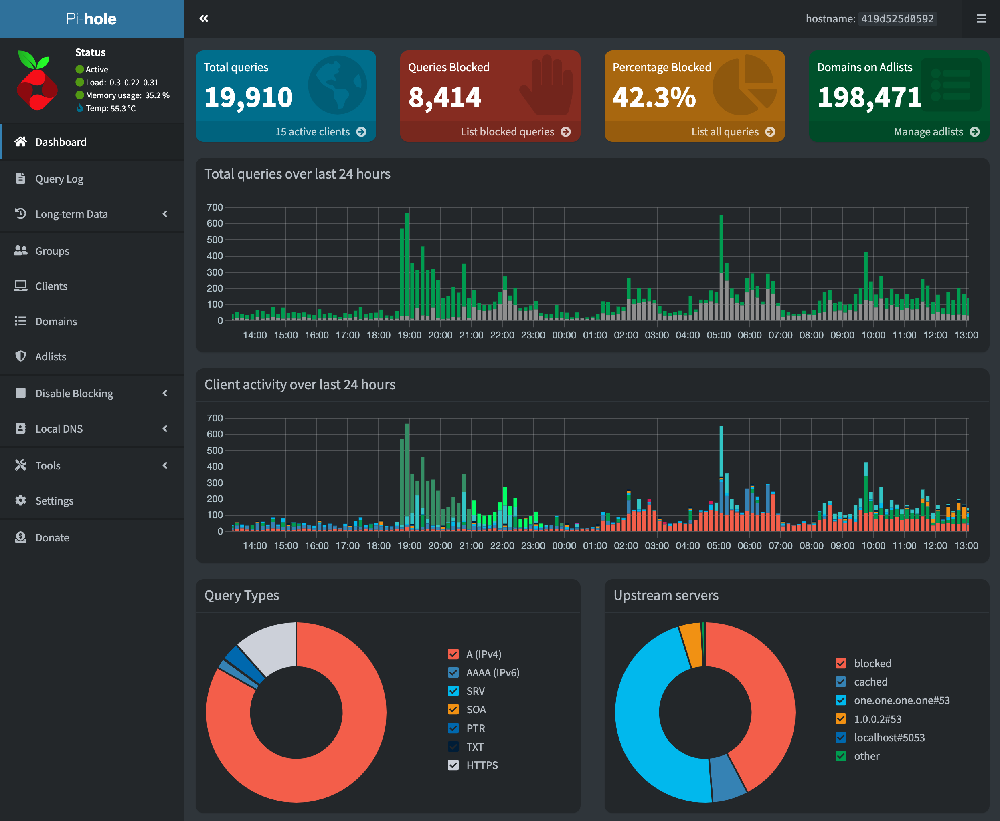

# README

## Secure Remote Access to Home Network Services

On the home server we need to have a secure connection to the web cameras. We want to limit who can access the cameras, and we don't want to run a VPN. And while we're at it, we might as well run the Pi-hole DNS blackhole on it, and point the IoT devices to use the Pi-hole. Finally, I'd like to have remote access to the server, so I added a 2nd Cloudflare tunnel so I can SSH to the host.

Cloudflare tunnels work well, and I've used them for more than a year. Cloudflare now calls this service, [Cloudflare Zero Trust](https://developers.cloudflare.com/cloudflare-one/applications/configure-apps/#:~:text=Cloudflare%20Docs-,Cloudflare%20Zero%20Trust,-Cloudflare%20Zero%20Trust), because hey, everyone wants zero trust now days.

I had to update my edge Raspberry Pi OS to Ubuntu 20.10, and decided to add [Pi-hole](https://docs.pi-hole.net/) to it as well. And since I'm upgrading, I wanted to up my game and finally learn to use [Docker](https://docker.com). So, I had to install [cloudflared](https://hub.docker.com/r/msnelling/cloudflared), [nginx](https://hub.docker.com/_/nginx), and [pihole](https://hub.docker.com/r/pihole/pihole) containers on the Raspberry Pi 3 B from 2015. (Aren't these things amazing?). I'm using a Docker image `msnelling/cloudflared` because I'm running this on an older Pi, but if you're using a newer one, you can use the official Cloudflare image `cloudflare/cloudflared:latest`

### Network Diagram for Cloudflare Tunnels

The diagram shows the connectivity between the system compoents, both internal and external, physical and virtual.

When the cloudflared container is created, it creates a bridge network named `cloudflared`. The nginx and pihole containters are added to cloudflared network so they can be available over the Cloudflare tunnel created by the cloudflared container.

The camera network will connect to the nginx container, restricting access to the camera webservers to the cloudflared tunnel. These are what Cloudflare calls [Self-hosted applications](https://developers.cloudflare.com/cloudflare-one/applications/configure-apps/self-hosted-apps/) and authentication can be controlled by your IdP such as Okta or Google for example. The diagram below shows the connectivity between the system components.

### Diagram of Home Network

The diagram below shows the connections on the server and to internal and external sites.

## Pihole Web Interface

## Repo Contents

This repo has the code to create services for our home server running:

* cloudflared - to create a private tunnel with a proxy managed by Cloudflare
* nginx - a reverse proxy for the camera webpages
* pihole - a DNS sinkhole and ad blocker
* cloudflared-host - tunnel to the host for SSH

## How to Install

---

### Prerequisites

1. Ubuntu 20.10
1. Docker installed and running
1. Cloudflare account and domain
1. [Configure your application(s)](https://developers.cloudflare.com/cloudflare-one/applications/configure-apps/) in Cloudflare

---

### Manage Docker as a non-root user

1. Create the `docker` group:
`sudo groupadd docker`
1. Add your user to the `docker` group:
`sudo usermod -aG docker $USER`
1. Logout and log back in
1. Verify that you can run `docker` without `sudo`:
`docker run hello-world`

See [Instructions from Docker](https://docs.docker.com/engine/install/linux-postinstall/) if there's any trouble.

### Build and Start Docker Containers

Clone this repo to host in your home directory
`gh repo clone beckitrue/pihole`

#### cloudflared

1. Change the image if you want to use the official Cloudflare image `cloudflare/cloudflared:latest`
1. Retrieve cloudflared token from password manager (or Cloudflare if this is your initial config) and edit the `docker-compose.yaml` file
1. `vi ~/cloudflared/docker-compose.yaml`
1. Build and start cloudflared docker container `docker compose -f ~/cloudflared/docker-compose.yaml up -d`
1. Go to [Tunnels dashboard](https://one.dash.cloudflare.com/699b49d3fee8e9138a49442ea0119cb6/access/tunnels) and verify that tunnel is healthy.

#### nginx

1. Build and start nginx docker container `docker compose -f ~/nginx/docker-compose.yaml up -d`
1. Go to [nginx webpage](https://cameras.beckitrue.com/) and verify it's working.

#### pihole

1. Retrieve pihole WEBADMIN password from password manager and edit the `docker-compose.yaml` file
1. `vi ~/pihole/docker-compose.yaml`
1. Build and start pihole docker container `docker compose -f ~/pihole/docker-compose.yaml up -d`
1. Go to [pihole admin page](https://pihole.beckitrue.com/admin/index.php) and verify it's working
1. Follow the instructions for [Installing on Ubuntu](https://github.com/pi-hole/docker-pi-hole#installing-on-ubuntu-or-fedora) on the pi-hole GitHub site. This is to make the pi-hole the DNS server running on the Raspberry Pi.
1. Follow the [Post-Install](https://docs.pi-hole.net/main/post-install/) instructions to complete the configuration **Make sure you have connectivity and the pi-hole is resolving DNS before making these changes, or you may not have DNS available**

#### cloudflared-host

1. Retrieve cloudflared token from password manager and edit the `docker-compose.yaml` file
1. `vi ~/cloudflared-host/docker-compose.yaml`
1. Build and start cloudflared docker container `docker compose -f ~/cloudflared-host/docker-compose.yaml up -d`
1. Go to [Tunnels dashboard](https://one.dash.cloudflare.com/699b49d3fee8e9138a49442ea0119cb6/access/tunnels) and verify that tunnel is healthy.

### Rebuild Containers

1. Pull latest image: `docker pull pihole/pihole`
1. `docker-compose up --build --remove-orphans --force-recreate -d`

## Troubleshooting

Running these services in Docker containers was meant to be a learning experience for me, and it was. Here are some troubleshooting steps I had to take to troubleshoot DNS, network connectivity, and re-creating containers to use configuration changes.

### Assumptions

* Assumes that your Cloudflare tunnel is working and you have your Application(s) configured in Cloudflare. Refer to Cloudflare documentation if your tunnel isn't working.
* Assumes that you are using the settings in the `docker-compose.yaml` files for ports, names, etc.
* Assumes you have configured the upstream DNS servers in Pi-hole

### Networking

1. Make sure you are running your services in the same network as your `cloudfared` container is running in.
1. `cloudflared` will create a bridge network named `cloudflared`, so you might as well put your services in that network. The [Docker documentation on networking](https://docs.docker.com/config/containers/container-networking/) is very good. Check it out if this is new to you.
1. You specify the network in the `docker-compose.yaml` file, and you can check out the details in the [Networking in Compose](https://docs.docker.com/compose/networking/) documentation. If you use the code in this repo, you'll see the network is specified in the `docker-compose.yaml` file. The containers are named, so we can use their names instead of IP addresses.
1. You can see which networks are configured by running `docker network ls` and you should see `cloudflared` listed
1. You can get details about the network by running `docker network inspect cloudflared`
1. You can see details about the container network configuration by running `docker inspect <container_name>`

### Connectivity

1. Check connectivity from a client computer such as your laptop, and verify that you can connect to the Pi-hole web UI `http://<server-ip>:8080/admin/index.php`
1. To check connectivity from `cloudflared` to `pi-hole` container run `docker exec -it cloudflared sh -c 'wget http://<container-ip-of-pi-hole>'` (you'll want to clean up and delete the `index.html` file when you're done).
1. Check connectivity between containers, and / or between the container and the world by running commands from within the container. The `cloudflared` containers run `sh`, and the `nginx` and `pihole` containers use `bash`
1. To test connectivity between `cloudflared` and `pihole` run `docker exec -it pihole bash -c 'ping -c 3 cloudflared'` *cloudflared doesn't have many troubleshooting applications installed - wget is about it*

### DNS

1. From the server host run `resolvectl status` to verify which DNS servers are configured. It should be the IP address of the `pi-hole` container in the `cloudflared` network, `127.0.0.1` or the IP address of the server.
1. The `docker-compose.yaml` files are configured to use the `pi-hole` for DNS. You can verify the configuration for the containers by running `docker inspect <container_name>`. Check the DNS settings match what you expect them to be.
1. From your client device, run `nslookup google.com <Pi-Hole Public IP Address>` and you should get a list of hosts

### Rebuilding Containers

 `docker-compose up --build --remove-orphans --force-recreate -d` will kill the container and force a rebuild.

## ToDo

* Add code scanning
* Deploy with Terraform
